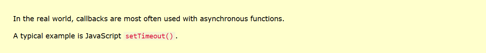
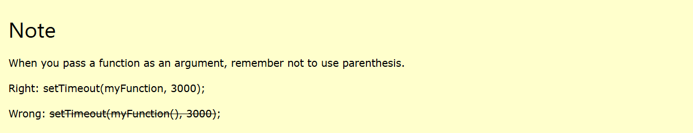
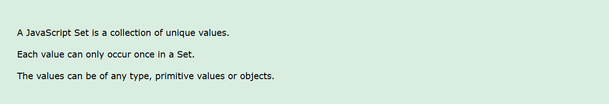

# JavaScript and Web Development Interview Questions  

---

## 1. Differences Between HTML and HTML5  

---

### **1. Audio and Video Support**  
- **HTML**: Did not support audio and video without the use of Flash Player.  
- **HTML5**: Supports audio and video controls with the use of `<audio>` and `<video>` tags.  

---

### **2. Data Storage**  
- **HTML**: Uses cookies to store temporary data.  
- **HTML5**: Uses SQL databases and application cache to store offline data.  

---

### **3. JavaScript Execution**  
- **HTML**: Does not allow JavaScript to run in the browser background.  
- **HTML5**: Allows JavaScript to run in the background using the Web Worker API.  

---

### **4. Vector Graphics**  
- **HTML**: Relied on external technologies like VML, Silverlight, or Flash for vector graphics.  
- **HTML5**: Integrates vector graphics through SVG and Canvas directly.  

---

### **5. Drag and Drop Effects**  
- **HTML**: Does not allow drag-and-drop effects.  
- **HTML5**: Supports drag-and-drop effects natively.  

---

### **6. Shape Drawing**  
- **HTML**: Could not draw shapes like circles, rectangles, or triangles.  
- **HTML5**: Allows shape drawing using Canvas.  

---

### **7. Browser Compatibility**  
- **HTML**: Works with all old browsers.  
- **HTML5**: Supported by modern browsers like Firefox, Chrome, Safari, etc.  

---

### **8. Mandatory Tags**  
- **HTML**: `<HTML>`, `<Body>`, and `<Head>` tags were mandatory.  
- **HTML5**: These tags can be omitted in some cases.  

---

### **9. Mobile Friendliness**  
- **HTML**: Less mobile-friendly.  
- **HTML5**: Designed to be more mobile-friendly.  

---

### **10. Doctype Declaration**  
- **HTML**: Doctype declaration was long and complicated.  
- **HTML5**: Doctype declaration is simple and easy.  

---

### **11. Semantic Elements**  
- **HTML**: Lacked semantic elements like `<nav>`, `<header>`, and `<footer>`.  
- **HTML5**: Introduced semantic elements for better web structure.  

---

### **12. Character Encoding**  
- **HTML**: Character encoding was long and complicated.  
- **HTML5**: Simplified character encoding.  

---

### **13. GeoLocation**  
- **HTML**: Could not get a user's GeoLocation easily.  
- **HTML5**: Supports GeoLocation API for accurate location tracking.  

---

### **14. Error Handling**  
- **HTML**: Could not handle inaccurate syntax.  
- **HTML5**: Capable of handling inaccurate syntax.  

---

### **15. Performance**  
- **HTML**: Older version, less efficient, flexible, and slower.  
- **HTML5**: Faster, more flexible, and efficient.  

---

### **16. New Attributes**  
- **HTML**: Attributes like `charset`, `async`, and `ping` were absent.  
- **HTML5**: Introduced attributes like `charset`, `async`, and `ping`.  

---

## 2. What is the Box Model?  

The **CSS box model** is a fundamental concept that describes the rectangular box generated for elements in a webpage. It includes:  

- **Content**: The actual content of the box, where text and images appear.  
- **Padding**: The space between the content and the border.  
- **Border**: The border surrounding the padding and content.  
- **Margin**: The outside space of the border, separating the element from others.  

---

## 3. Difference Between `id` and `class`  

### **Class Selector**  
- Defined using a dot (`.`) followed by the class name.  
- Classes can be applied to multiple elements.  
- One element can have multiple classes.  

### **ID Selector**  
- Defined using a hash (`#`) followed by the ID name.  
- IDs are unique within a document and should only be applied to one element.  

**Priority**:  
- ID selectors have higher priority than class selectors because they are more specific.  

---

## 4. Differences Between `var`, `let`, and `const`  

### **1. Scope**  
- **`var`**: Function-scoped.  
- **`let`**: Block-scoped.  
- **`const`**: Block-scoped, and its value cannot be reassigned.  

---

### **2. Hoisting**  
- **`var`**: Hoisted with an initial value of `undefined`.  
- **`let` and `const`**: Hoisted but not initialized.  

---

### **3. Reassignment**  
- **`var`**: Can be reassigned.  
- **`let`**: Can be reassigned.  
- **`const`**: Cannot be reassigned.  

---

### **4. Redeclaration**  
- **`var`**: Can be redeclared.  
- **`let` and `const`**: Cannot be redeclared.  

---

## 5. What is a Media Query?  

A **media query** in CSS applies styles based on the user's device characteristics, like screen size, resolution, or orientation. It enables responsive design for different devices.  
```
### **Syntax**  
```css
@ media (max-width: 600px) {
    body {
        background-color: lightblue;
    }
}
```
---
## 6. What is a Callback Function?  

A **callback function** is a function passed as an argument to another function. 
The receiving function can then execute the callback at a later time, usually after completing an operation.

### **Key Features**
1. A callback function is executed after the completion of another function.  
2. It allows asynchronous operations, like reading files, making API calls, or handling user inputs, to run smoothly without blocking code execution.  
3. Can be either **synchronous** or **asynchronous**, depending on how it is invoked.

### **When is it Used?**
- **Asynchronous Operations**:  
  Used in operations like:
  - Fetching data from an API
  - Reading files
  - Timer events
  - Handling DOM events  
```
### **Syntax Example:**
```javascript
function greet(name, callback) {
    console.log("Hello, " + name);
    callback(); // Execute the callback
}

function sayGoodbye() {
    console.log("Goodbye!");
}

greet("Alice", sayGoodbye);
// Output:
// Hello, Alice
// Goodbye!
```
---

## 7. What is a Promise?  

A **promise** is an object that represents the outcome of an asynchronous operation, such as an API call or reading a file. 
 Promises help make asynchronous operations more organized and readable.
 It can be in one of three states: **pending**, **fulfilled**, or **rejected**.

### **Difference Between a Callback and a Promise**
- A **callback** is a function that's called when an asynchronous operation is complete.
- A **promise** returns a value or error after the operation is complete, allowing for cleaner code and better error handling.

### **Key Features of Promises**  
1. **Pending**: The initial state; the operation is not yet complete.  
2. **Fulfilled**: The operation is completed successfully, and a value is available.  
3. **Rejected**: The operation failed, and an error reason is available.  
```
### **Syntax Example:**
```javascript
let promise = new Promise((resolve, reject) => {
    // Perform an asynchronous task
    if (/* success condition */) {
        resolve("Success!"); // Fulfill the promise
    } else {
        reject("Error!"); // Reject the promise
    }
});
```
---

## 8. What is the event loop?
The event loop enables asynchronous programming, allowing developers to write code 
that can execute operations without waiting for previous ones to complete.

```javascript
console.log("Start");

setTimeout(() => {
    console.log("Inside setTimeout");
}, 2000);

console.log("End");
Output
Start
End
Inside setTimeout
```
---

## 9. what is CSS Preprocessor?
CSS preprocessors are scripting languages that extend the default capabilities of CSS. They enable us to use logic in our CSS code,
such as variables, nesting, inheritance, mixins, functions, and mathematical operations.
```CSS
$primary-color: #333;
$font-size: 16px;

body {
  font-family: Arial, sans-serif;
  font-size: $font-size;
  color: $primary-color;
}
```
---

## 10. What is AJAX?
AJAX (Asynchronous JavaScript and XML) is a technique used in web development to send and receive data from a server asynchronously, 
without having to reload the entire page. This allows web pages to update content dynamically, providing a smoother user experience.

---

## 11. Tell some Git commands ?

### **`git init`**  
Initializes a new empty Git repository in the current directory.

### **`git clone <repository>`**  
Clones an existing repository from a remote source (e.g., GitHub) to your local machine.

### **`git add . `**  
Stages all changes (modified, new, deleted files) in the current directory.

### **`git commit -m "message"`**  
Commits the staged changes with a descriptive message.

### **`git status`**  
Displays the current status of the working directory and staging area.

### **`git pull`**  
Fetches and merges changes from the remote repository to your local repository.

### **`git push`**  
Pushes local commits to the remote repository.

---


# 12. Difference Between `null` and `undefined`
### **`null` type :Object  **
A deliberate absence of a value or object

- Example : let user = null;  // No user is assigned yet

### **`undefined`**
A variable that has been declared but not assigned a value.
- Example :
- let name;  // Declared but not assigned
- console.log(name);  // Output: undefined

---

# 13. Tell some new features in ES6.


### 1. `let` and `const`
### 2. Arrow Functions
### 3. Template Literals
### 4. Destructuring Assignment
### 5. Default Parameters
### 6. Rest and Spread Operators
### 7. Classes


---

# 14. Difference between Arrow and normal functions?

### Normal functions are declared using the function keyword, while arrow functions are not.
### Normal functions create a **this** variable that references the objects that call them, while arrow functions do not.
### In regular functions, you always have to return any value, but in arrow functions you can skip the return keyword and write in a single line
### **`Hoisting`**
Regular functions are hoisted to the top of their containing scope, while arrow functions cannot be accessed before they are initialized.

---

# 15  What is a closuer?
When you create a function inside another function, the inner function can access variables from the outer function.
A closure allows the inner function to continue accessing those variables, even after the outer function has returned.

```javascript
function outerFunction() {
    let outerVariable = "I am from outer function";  // Outer variable

    function innerFunction() {
        console.log(outerVariable);  // Inner function accessing outer variable
    }

    return innerFunction;  // Return the inner function
}

const closureFunction = outerFunction();  // outerFunction() is called, returning innerFunction
closureFunction();  // Output: I am from outer function
```

---

# 16. What is the "This" keyword in JS?

Inside an Object Method: When a function is a method of an object, this refers to the object that called the function.

```javascript
const person = {
    name: "Alice",
    greet: function() {
        console.log(this.name);  // 'this' refers to the person object
    }
};
person.greet();  // Output: Alice
```

--- 
# 17. What is React JS and its use?

	React is a JavaScript library for building UI.
	
	Developed and maintained by Facebook, released on 2013
	
	it used to create Dynamic and interactive Web apps.

	React is the most popular library for making Single Page Applications

	it is an open source library , which means it is available for free and has a large and active community

  ---
# 18. What is JSX?
JSX lets you write HTML tags and JavaScript logic in the same file, making it easier to create dynamic and interactive user interfaces.

---

# 19. Does our browser directly understand JSX?
No, browsers cannot directly understand JSX. JSX is a syntax extension that combines HTML-like code with JavaScript, 
but browsers only understand plain JavaScript.

---

# 20 What is Webpack?
Webpack is a free, open-source tool that bundles JavaScript files and other front-end assets into static assets for web applications
Webpack can make files smaller and faster, which can help your site load faster. 

---

# 21 Life cycle method in React JS?
React components go through a series of stages from when they are created to when they are removed from the DOM. 
These stages are called the component lifecycle, and React provides lifecycle methods to hook into three stages.
- **Mounting** - This phase begins when a component is created and inserted into the DOM.
- **Updating** - This occurs when a component is re-rendered due to changes in props or state.
- **Unmounting** - This is the final phase when a component is removed from the DOM.

--- 

# 22. What is ref?
A ref is a reference to a DOM element or component instance. It's a way to access and modify DOM elements without using props or states.

---
# 23. Explain map, filter, and reduce?

### **map() Method**
The map() method in JavaScript is used to create a new array by applying a function to each element of the original array. 
It iterates through each element of the array and invokes a callback function for each element. 
The result of the callback function is then added to the new array.
```
let arr= [2, 4, 8, 10]
let updatedArr = arr.map(val=> val+2)
console.log(arr);
console.log(updatedArr); //[4,6,10,12]
```
### **filter() Method**
The filter() method in JavaScript is used to create a new array with all elements that pass a certain condition defined by a callback function. 
It iterates through each element of the array and invokes the callback function for each element. 
If the callback function returns true for an element, that element is included in the new array; otherwise, it is excluded.
```
let arr = [2, 4, 8, 10];
let updatedArr = arr.slice().filter(val => val < 5);
console.log(arr);
console.log(updatedArr); //[2,4]
```
### **reduce() Method**
The reduce() method in JavaScript is used to reduce an array to a single value. 
It executes a provided callback function once for each element in the array, resulting in a single output value. 
The callback function takes four arguments: accumulator, currentValue, currentIndex, and the array itself.
```
let arr= [2,4,8,10]
let updatedArr = arr.reduce((prev, curr)=> curr= prev+curr)
console.log(arr);
console.log(updatedArr);//24
```
---

# 24. Difference between state and props in React JS?
### **States**
State is a built-in React feature that allows components to store and manage data that can change over time.
State is used to handle dynamic data, such as user inputs, component interaction, or fetched data.

### **props**
Props (short for "properties") are used to pass data from a parent component to a child component.
Data passed from a parent component to a child component, read-only and immutable by the child.

---
# 25. what is Virtual Dom?
Virtual DOM (Document Object Model) is a lightweight, in-memory representation of the actual DOM. 
It acts as a blueprint of your UI, which frameworks like React use to optimize updates and rendering.

---
# 26 How does react works?
React creates virtual DOM. when the state changes in component then it first run "diffing" algorithm.
which identifies what has changed in the virtual DOM.
The second step is reconciliation, where it updates the DOM with the result of diffs.

---
# 27. What is a router in React?
React Router is a library for handling routing and navigation in React JS Applications. 
It allows you to create dynamic routes providing a seamless user experience by mapping various URLs to components. 
It enables navigation in single-page application (SPA) without refreshing the entire page.

---
# 28. Server-side rendering?
Server-Side Rendering (SSR) in React is a technique that involves rendering React components on the server side instead of the client side (browser).
Traditionally, React applications are rendered on the client side, meaning that the browser downloads the JavaScript bundle, executes it, 
and renders the UI. In contrast, with SSR, the server pre-renders the React components into HTML before sending it to the client.

---
# 29. How to optimize the performance of a web application?
> Ways to optimize performance:
> * Optimizing images and other media files.
> * Minimizing HTTP requests by reducing the number of elements on a page.
> * Enabling browser caching.
> * Using content delivery networks (CDNs).
> * Minifying CSS, JavaScript, and HTML code.

---
# 30. Flexbox and what it does?
Flexbox is a CSS layout system that allows you to arrange elements in a container in a flexible way
Flexbox arranges elements in rows or columns, and the elements can grow or shrink to fit the container space. 
This makes it useful for aligning items of different sizes.

---
# 31. Difference between real and virtual DOM?
Real DOM is the actual structure represented in the User Interface and 
The virtual DOM object is the same as a real DOM object, except that it is a lightweight copy.

---

# 32. what is Asynchronous JavaScript?





---
# 33. what is Destructuring ?
It is a technique that breaks down data structures, such as arrays and objects, into separate variables for easier access to their value.

---

# 34. What is optional Chaining?
- It allows accessing properties on an object, that may or may not exist, with a compact syntax. It can be used with the ?. operator when accessing properties. 
- Optional Chaining allows you to write code which can immediately stop running expressions when it hits a null or undefined.

---
# 35 What is set?



---
# 36. what is Polymorphism?
The polymorphism in JavaScript allows you to define multiple methods with the same name and different functionalities. 
Polymorphism is achieved by using method overloading and overriding. 
- Method Overriding: A child class overrides a method of its parent class.
- Method Overloading (simulated): A function behaves differently based on the number or type of its arguments.
``` javascript

class Animal {
  speak() {
    console.log("The animal makes a sound");
  }
}

class Dog extends Animal {
  speak() {
    console.log("The dog barks");
  }
}

class Cat extends Animal {
  speak() {
    console.log("The cat meows");
  }
}

// Polymorphic behavior
const animals = [new Animal(), new Dog(), new Cat()];

animals.forEach(animal => {
  animal.speak(); // Calls the appropriate speak() method for each object
});

Output :
 //The animal makes a sound
//The dog barks
//The cat meows

```
---
# 37. what is abstraction ?
JavaScript abstraction refers to the concept of hiding complex implementation details and showing only the essential features or functionalities of an object or module to the user also it is the fundamental concept in object-oriented programming.

---
# 38. what is encapsulation ?
- Encapsulation in JavaScript is a concept that involves bundling data (attributes) and the methods (functions) that operate on that data into a single unit, known as an object. 

- This bundling restricts direct access to some of the object's components, preventing unintended interference and misuse. 

- Encapsulation helps in organizing and managing the complexity of code and promotes the principle of ** data hiding **, where the internal details of an object are hidden from external code.

---

# 39. what is Inheritance ?
It is the process of passing down properties and methods from a parent class to a child class.

---

# 40. What is Recursion ?
Recursion is the technique of making a function call itself. For example, we can define the operation "find your way home" as: If you are at home, stop moving. Take one step toward home.

---
# 41. What is Lexical Scope?
Lexical scope is the ability for a function scope to access variables from the parent scope.

```
function x(){
  var a=10;
  function y(){
      console.log(a); // will print a , because of lexical scope, it will first look 'a' in 
  //its local memory space and then in its parent functions memory space
  }
  y();
}
x();
```
---
# 42. 